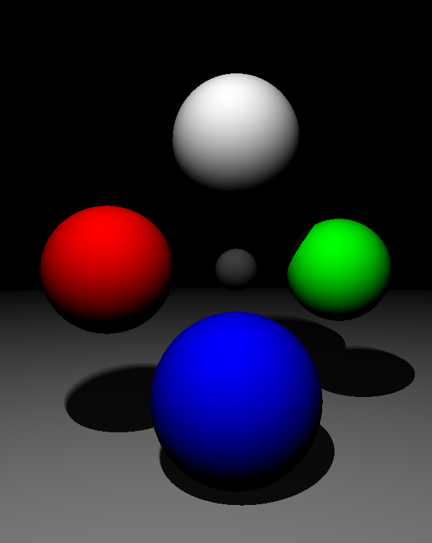

# Roytracer



Minimal raytracer, so minimal in fact it only traces spheres. There are 3
versions, serial, OpenMP and CUDA; `Roytracer` made primarily to learn more about
GPU computing. The code is deliberately straight forward, and hopefully readable
for those that are interested - don't expect best practices by any means.

The main focus should be on the following files:

```
    src/cuda/raytace.cu
    src/cpu/raytrace.c
```

The rest of the code is largely boiler plate for setting up OpenGL etc.

In terms of performance the CUDA version was more than 100x faster than the
serial implementation. With the serial version averaging a mean frametime of
around 100ms, throwing in 16 threads this comes down to around 60ms, finally the
CUDA version was in the sub-millisecond range at around 0.7ms.

## Dependencies

 - GLFW - 3.0 or greater.
 - CUDA - 7.5, should compile on much older versions.
 - GLAD - GL 2.1.

## Build

Run `BUILD.{bat,sh}` to build the application:

 - `BUILD.{bat,sh} build cuda` - this builds the CUDA version.
 - `BUILD.{bat,sh} build omp` - this builds the OpenMP version.
 - `BUILD.{bat,sh} build` - this builds the serial version.

### Windows Only

To build for Win32 you need only run the BUILD.bat file, however this will need
to be run within an appropriate environment.

Locate and run the `vcvarsall.bat` file, this should be located within the
Visual Studio install directory under the `VC` directory. Execute this file in
a command prompt as follows:

```
    %PATH_TO_VCVARSALL%/vcvarsall.bat x64
```

## Running

Usage:

```
    BUILD.bat run
```

## License

This software is in the public domain. Where that dedication is not recognized,
you are granted a perpetual, irrevocable license to copy, distribute, and modify
the source code as you see fit.

The source code is provided "as is", without warranty of any kind, express or implied.
No attribution is required, but always appreciated.
